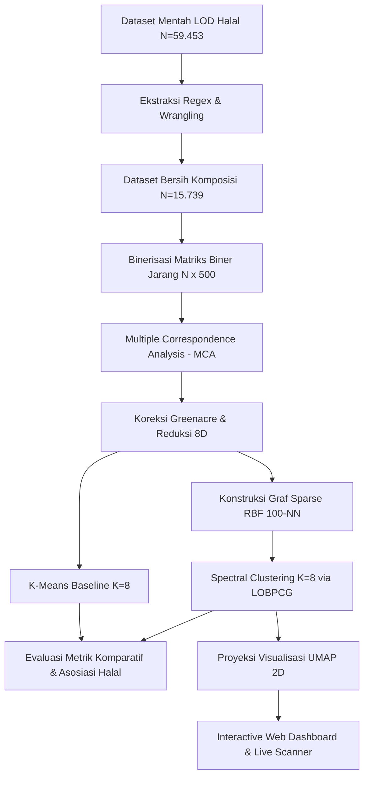

# Navigasi Integritas Halal: Pemetaan Komputasional Bahan Pangan Riil Berbasis Multiple Correspondence Analysis (MCA) dan Sparse RBF Spectral Clustering

**Repositori Proyek Akhir Kelompok — Mata Kuliah: Python untuk Sains Data / Data Storytelling**

---

## 📌 Ringkasan Eksekutif

Integritas rantai pasok pangan halal merupakan isu krusial yang memerlukan transparansi dan audit objektif berbasis kandungan bahan baku riil. Repositori ini menyajikan **Navigasi Integritas Halal**, sebuah sistem analisis data komprehensif yang memetakan keterkaitan zat aditif pangan komersial di Indonesia ($N = 15.739$ produk) menggunakan data graf semantik *Linked Open Data (LOD) Halal*. 

Dengan menggabungkan teknik statistika multivariat lanjut—**Multiple Correspondence Analysis (MCA)** untuk reduksi dimensi kategorikal biner jarang berdimensi tinggi ($P = 500$ bahan) dan **Spectral Clustering** berbasis kernel **Sparse RBF Similarity Matrix**—kami mengidentifikasi pola formulasi industri pangan dan memetakan risiko titik kritis halal (*Critical Control Points* / CCP) secara spasial.

Proyek ini menyajikan narasi visual (*data storytelling*) melalui 4 infografis analitis terintegrasi dan purwarupa **Interactive Web Dashboard** yang dilengkapi dengan **Live Recipe Scanner** untuk membantu BPJPH (Badan Penyelenggara Jaminan Produk Halal), auditor, dan konsumen mendeteksi titik kritis halal secara otomatis dan transparan.

---

## 🔬 Latar Belakang & Rumusan Masalah

Sertifikasi halal administratif sering kali menciptakan celah pengawasan (*blind spot*) karena minimnya keterbukaan informasi komposisi bahan baku riil produk pada basis data publik. Eksplorasi awal kami menunjukkan bahwa **73,53%** produk bersertifikat administratif justru menyembunyikan rincian bahan baku mereka dalam pangkalan data digital.

Secara statistika, data formulasi pangan bersifat kategorikal biner berdimensi tinggi dan sangat jarang (*sparse*). Pendekatan multivariat klasik seperti perpaduan MCA dengan **K-Means Clustering** gagal mengelompokkan data ini secara akurat karena K-Means mengasumsikan klaster berbentuk bola cembung (*spherical*) dalam jarak Euclidean linier. Pada data riil, bahan pangan menyebar mengikuti alur cabang kontinu (*manifold*). K-Means memotong paksa manifold ini sehingga mengelompokkan **10.022 produk ke dalam satu klaster raksasa**, mengabaikan jalinan kemiripan biokimia asli.

Penelitian ini memecahkan keterbatasan tersebut menggunakan **Spectral Clustering** berbasis topologi graf, yang berhasil memetakan manifold sebaran bahan pangan secara proporsional dengan asosiasi status kehalalan yang jauh lebih kuat di lapangan.

---

## ⚙️ Metodologi & Alur Analisis Data

Sistem ini dikembangkan secara sistematis berdasarkan metodologi standar industri **CRISP-DM** (*Cross-Industry Standard Process for Data Mining*):



### 1. Ekstraksi Data Semantik (RDF to Tabular)
Menggunakan parser Python berbasis Regular Expression (`extract_data.py`) untuk mengekstrak entitas produk (`FoodProduct`), sertifikat halal (`HalalCertificate`), dan bahan baku (`containsIngredient`) dari database graf RDF Turtle (`lodhalalturtle.ttl`).

### 2. Harmonisasi Fatwa & worst-case Risk Propagation
Komposisi bahan baku diselaraskan dengan aturan fatwa MUI. Status kehalalan objektif tingkat produk ditentukan dengan aturan:
*   **Haram**: Mengandung minimal 1 bahan haram (misal: lemak babi/lard, gelatin babi).
*   **Mushbooh (Syubhat)**: Mengandung minimal 1 bahan kritis tanpa kejelasan sertifikasi (misal: gelatin hewani, whey, pengemulsi E471).
*   **Halal**: Bebas dari bahan haram/syubhat dan sepenuhnya terdiri dari bahan aman (nabati/inheren halal).

### 3. Reduksi Dimensi MCA dengan Koreksi Greenacre
MCA digunakan untuk mereduksi matriks biner jarang 500 dimensi. Jumlah dimensi dioptimalkan berdasarkan **Koreksi Greenacre** (mempertahankan komponen dengan varians kontribusi di atas ambang kritis $\frac{1}{Q} = 3.33\%$). Terpilih **8 komponen MCA** yang mencakup **52.96%** akumulasi varians.

### 4. Pembagian Klaster Spektral Graf
Membangun matriks ketetanggaan graf $A$ menggunakan $k=100$ tetangga terdekat (KNN) dan kernel RBF ($\gamma = 0.125$). Kami melakukan dekomposisi nilai eigen pada matriks Laplacian ter-normalisasi simetris $L_{sym}$ menggunakan solver **LOBPCG** untuk memperoleh proyeksi spektral yang memisahkan manifold non-linier.

---

## 📊 Hasil Uji Metrik Komparatif

Perbandingan komparatif membuktikan keunggulan mutlak model konektivitas graf (Spectral Clustering) atas partisi linear (K-Means) pada data pangan riil:

| Kategori Pengujian | Nama Metrik | K-Means ($K=8$) | Spectral Clustering ($K=8$) | Interpretasi & Arah Kualitas |
| :--- | :--- | :---: | :---: | :--- |
| **I. Kualitas Graf** | **10-NN Connectivity Score** | `0.9554` | **`0.9535`** | **Tinggi lebih baik.** K-Means bias naik karena menumpuk data di satu klaster tunggal (C2). |
| | **Average Graph Conductance** | `0.1246` | **`0.0936`** | **Rendah lebih baik.** Mengukur kebocoran tepi antar klaster graf. **Spectral jauh lebih bersih.** |
| **II. Asosiasi Halal** | **Cramer's V (Korelasi Halal)** | `0.3853` | **`0.5098`** | **Tinggi lebih baik.** Kekuatan hubungan klaster dengan status kehalalan objektif lapangan. |
| | **Adjusted Mutual Info (AMI)** | `0.1298` | **`0.2157`** | **Tinggi lebih baik.** Berbagi informasi timbal-balik klaster-kehalalan. |
| | **Normalized Mutual Info (NMI)** | `0.1302` | **`0.2160`** | **Tinggi lebih baik.** Skala normalisasi kesamaan informasi. |
| **III. Struktur Geometris** | **Silhouette Score (Euclidean)** | **`0.4136`** | `-0.0807` | **Tinggi lebih baik.** K-Means unggul semu karena Silhouette memihak partisi berbentuk bola linier. |
| | **Davies-Bouldin Index (DBI)** | **`1.0663`** | `1.6538` | **Rendah lebih baik.** Mengukur rasio jarak dalam klaster secara linier. |

*Analisis Kritis: Nilai Silhouette negatif pada Spectral Clustering merupakan fenomena geometris wajar pada data manifold non-konveks. Namun, keunggulan performa riil dibuktikan oleh nilai Cramer's V (0.5098 vs 0.3853) dan AMI yang jauh lebih tinggi, menunjukkan klaster Spectral memiliki makna praktis biokimia halal yang jauh lebih konsisten.*

---

## 🗂️ Karakteristik & Titik Kritis Halal (CCP) 8 Klaster Optimal

Melalui Spectral Clustering, produk pangan dikelompokkan secara alamiah menjadi 8 kategori fungsional dengan profil risiko kehalalan objektif masing-masing:

| Klaster | Deskripsi Kategori Dominan | Rata-rata Bahan | Kehalalan Objektif | Kategori Risiko | Titik Kritis Utama (Critical Control Points / CCP) |
| :---: | :--- | :---: | :---: | :---: | :--- |
| **C1** | Bumbu Penyedap & Olahan Gurih | 8.2 | 15.3% | **Tinggi** | Daging sembelihan RPH, media fermentasi mikrobial MSG/ekstrak ragi, dan penyalut perasa. |
| **C2** | Makanan Ringan & Sayur Awetan | 4.8 | 83.3% | **Sedang** | Potensi kontaminasi silang jalur produksi mesin pengolah lemak hewani. |
| **C3** | Jus Buah & Makanan Bayi Organik | 3.5 | 76.2% | **Rendah** | Agen penjernih (*clarifying agent*) berbasis gelatin babi, penyalut vitamin larut lemak. |
| **C4** | Olahan Tepung & Sereal Fortifikasi | 24.8 | 2.7% | **Sangat Tinggi** | Pelembut adonan L-sistein (dari bulu unggas/rambut), penyalut vitamin fortifikasi. |
| **C5** | Saus Buah & Pemanis Konsentrat | 3.8 | 89.0% | **Sedang** | Bahan pengental (pektin komersial campuran gelatin), pewarna merah karmin (E120). |
| **C6** | Daging Sapi Segar & Olahan Murni | 2.1 | 6.9% | **Sangat Tinggi** | Validitas metode penyembelihan syar'i RPH dan risiko pemalsuan/pencampuran daging celeng. |
| **C7** | Komoditas Pertanian Mentah & Teh | 1.1 | 97.8% | **Sangat Rendah** | *Halal Asali*. Risiko minimal, hanya terbatas pada pelarut kimia dekafeinasi kopi/teh. |
| **C8** | Permen, Roti Manis, & Olahan Susu | 15.4 | 38.2% | **Sangat Tinggi** | Gelatin hewani pada permen jelly, mentega/shortening lemak babi, bubuk whey (rennet koagulan). |

*Kesimpulan Analisis Spasial: Semakin tinggi kompleksitas resep (jumlah aditif), tingkat kehalalan objektif produk cenderung menurun drastis karena akumulasi risiko bahan kritis.*

---

## 🎨 Galeri Visual Data Storytelling

Narasi data disajikan melalui **4 infografis visual** terintegrasi yang diekspor otomatis ke folder `output_halal/`:

1.  **Dashboard Overview (`fig1_dashboard_overview.png`)**: Menampilkan statistik makro LOD Halal, sebaran status halal, dan kesenjangan besar ketersediaan data bahan baku produk terdaftar.
2.  **Analisis Bahan Bermasalah (`fig2_bahan_bermasalah.png`)**: Memetakan frekuensi penggunaan aditif syubhat dan haram, menyoroti gelatin sebagai bahan kritis terbanyak (620 kali).
3.  **Heatmap Ko-kemunculan Bahan (`fig3_cooccurrence_heatmap.png`)**: Menyingkap korelasi erat zat aditif kritis (seperti flavoring carrier) yang disamarkan di dalam resep garam, air, dan dextrose.
4.  **Karakteristik Kluster Pangan (`fig4_cluster.png`)**: Menunjukkan hubungan non-linier antara kompleksitas jumlah bahan aditif per produk terhadap persentase kehalalan objektifnya di tiap klaster produk.

---

## 💻 Purwarupa Web Dashboard Interaktif

Sebagai implementasi hilir (*Deployment*), purwarupa web dashboard interaktif kami kembangkan dan host secara publik di:
🔗 **[halal-analyzer.pages.dev](https://halal-analyzer.pages.dev)**

### Fitur Utama Dashboard:
*   🗺️ **UMAP 2D Explorer**: Menyajikan proyeksi sebaran 15.739 produk pangan dalam ruang spektral 2D secara interaktif. Pengguna dapat melakukan hover untuk melihat kandungan bahan, klaster, dan risiko halal secara spasial.
*   🔍 **Live Recipe Scanner**: Alat penapisan otomatis berbasis web. Pengguna dapat mengetikkan daftar bahan baku makanan secara bebas untuk dianalisis status kehalalannya secara instan berdasarkan pencocokan fatwa MUI.

---

## 📂 Peta Struktur Folder Workspace

```text
tugas_akhir_data_storytelling/
├── data/
│   └── processed/          # Dataset tabular CSV hasil pemrosesan dan klasterisasi
├── src/                    # Modul Python reusable
│   ├── parser.py           # Parser RDF Turtle semantik
│   ├── classifier.py       # Heuristic worst-case risk propagation classifier
│   ├── modeling.py         # Engine MCA dan Spectral Clustering
│   ├── evaluation.py       # Perhitungan metrik evaluasi komparatif (AMI, Conductance, dll)
│   └── visualization.py    # Skrip plotting visualisasi & dashboard
├── scripts/                # Runner CLI untuk menjalankan pipeline
│   ├── run_modeling.py     # Menjalankan pemrosesan dan pemodelan data
│   └── run_storytelling.py # Mengekspor 4 gambar infografis visual
├── web_dashboard/          # Source code aplikasi web interaktif
│   ├── index.html          # Halaman utama dashboard
│   ├── index.css           # Desain antarmuka premium (Light/Dark Mode)
│   ├── app.js              # Logika frontend, UMAP Chart.js, dan scanner
│   └── data/               # Database terkompresi MessagePack & JSON
├── reports/                # Laporan akhir tugas kelompok komprehensif
│   ├── Laporan_Gabungan_Data_Storytelling_Halal.md   # Laporan format Markdown
│   └── Laporan_Gabungan_Data_Storytelling_Halal.docx # Laporan format Word terformat
└── output_halal/           # Hasil ekspor 4 gambar infografis storytelling
```

---

## ⚡ Petunjuk Replikasi & Menjalankan Pipeline (End-to-End)

Untuk mereplikasi seluruh alur data, pemodelan, dan visualisasi dari awal, silakan ikuti langkah-langkah berikut secara berurutan:

### Langkah 1: Instalasi Dependensi & Lingkungan Kerja
Pastikan Python 3.8+ telah terpasang. Jalankan perintah berikut untuk menginstal seluruh pustaka yang diperlukan:
```bash
pip install numpy pandas matplotlib seaborn scikit-learn umap-learn docx pypandoc
```
*(Catatan: Pasang program `pandoc` di sistem Anda jika ingin mengekspor/kompilasi laporan Markdown `.md` ke format Word `.docx`.)*

### Langkah 2: Persiapan Database Mentah
Letakkan database graf semantik mentah `lodhalalturtle.ttl` di salah satu lokasi berikut agar dapat dideteksi secara otomatis oleh sistem:
* Direktori root: `tugas_akhir_data_storytelling/lodhalalturtle.ttl`
* Direktori data mentah: `tugas_akhir_data_storytelling/data/raw/lodhalalturtle.ttl`
* Direktori induk: `../lodhalalturtle.ttl`

### Langkah 3: Ekstraksi Data Semantik (RDF ke Tabular)
Jalankan skrip parser untuk mengekstrak triples dari format Turtle semantik menjadi format tabular datar (flat CSV):
```bash
python scripts/extract_data.py
```
*Output:* File tabular hasil ekstraksi akan disimpan di `data/processed/halal_products_tabular.csv`.

### Langkah 4: Pemodelan Spasial & Pengklasteran Spektral
Jalankan skrip pemodelan utama untuk melakukan klasifikasi kehalalan objektif (worst-case), reduksi dimensi MCA (8 komponen), pembangunan graf ketetanggaan 100-NN, Spectral Clustering ($K=8$), dan proyeksi UMAP 2D:
```bash
python scripts/run_modeling.py
```
*Output:*
* File dataset klaster spasial: `data/processed/product_spectral_clusters.csv`
* Plot visualisasi sebaran klaster 2D: `mca_spectral_plot.png`

### Langkah 5: Evaluasi Model & Tuning Rentang Nilai K
Jalankan skrip evaluasi komparatif untuk membandingkan model berbasis konektivitas graf (Spectral) dengan pemotongan linier (K-Means), serta melakukan tuning jumlah klaster dari $K=2$ hingga $13$:
```bash
python scripts/run_evaluation_tuning.py
```
*Output:*
* Grafik perbandingan partisi spasial K-Means vs Spectral: `kmeans_vs_spectral_comparison.png`
* Berkas metrik performa tiap nilai K: `data/processed/spectral_k_range_results.csv`
* Grafik kurva evaluasi Cramer's V & Graph Conductance: `spectral_k_range_evaluation.png`

### Langkah 6: Ekspor Grafik Infografis Visual Storytelling
Jalankan skrip visualisasi agregat untuk mengekspor 4 gambar infografis data storytelling ke folder keluaran:
```bash
python scripts/run_storytelling.py
```
*Output:* 4 berkas gambar infografis di dalam folder `output_halal/`:
1. `output_halal/fig1_dashboard_overview.png` (Statistik makro & blind spot data)
2. `output_halal/fig2_bahan_bermasalah.png` (Distribusi bahan kritis syubhat/gelatin)
3. `output_halal/fig3_cooccurrence_heatmap.png` (Pola ko-kemunculan aditif industri)
4. `output_halal/fig4_cluster.png` (Grafik hubungan kompleksitas aditif vs persentase kehalalan)

### Langkah 7: Menjalankan Dashboard Interaktif secara Lokal
1. Masuk ke direktori dashboard web: `cd web_dashboard`
2. Jalankan HTTP server lokal (misalnya menggunakan Python):
   ```bash
   python -m http.server 8000
   ```
3. Buka browser dan akses alamat `http://localhost:8000` untuk berinteraksi dengan **UMAP 2D Explorer** dan **Live Recipe Scanner**.

---

## 👥 Identitas Anggota Kelompok

Proyek akhir dan laporan gabungan ini disusun secara kolaboratif oleh:
*   👤 **Anwar Rohmadi** (NIM: 247411027)
*   👤 **Muhammad Fathir Raihan Al Farici** (NIM: 247411007)
*   👤 **Muhammad Thoriq Yusron Muttaqiin** (NIM: 247411016)
*   👤 **Muhammad Rasyid Arrafi** (NIM: 247411019)
*   👤 **Naufal Ajwa Nurfarros** (NIM: 247411024)
*   👤 **Ravelino Bagas Pratama** (NIM: 247411025)

---

## 📖 Daftar Pustaka

1.  **Bosman, O., Soesilo, T. E. B., & Rahardjo, S. (2022).** Sustainable Status of Vaname Shrimp (Litopenaeus vannamei) Through Multi Dimensional Scaling (MDS) Approach. *Jurnal Airaha*, 11(02), 267–280.
2.  **Kementerian Kelautan dan Perikanan RI (KKP). (2025).** KKP Pamerkan Potensi Udang Indonesia di Shrimp Summit 2025 Bali. *Siaran Pers KKP*.
3.  **Komisi Pemberantasan Korupsi (KPK). (2025).** Soroti Kebocoran di Perizinan Tambak, KPK: Hanya 10% di NTB yang Kantongi Izin Lengkap. *Publikasi KPK*.
4.  **FAO. (2024).** The State of World Fisheries and Aquaculture 2024. *Food and Agriculture Organization of the United Nations*.
5.  **Universitas Islam Negeri Maulana Malik Ibrahim Malang. (2025).** Implementasi Spectral Clustering untuk Pengelompokkan Kabupaten/Kota di Indonesia Berdasarkan Indeks Khusus Penanganan Stunting. *Tesis*.
6.  **Ahmed, M., Chowdhury, M.A., Rahman, M.M., & Islam, M.N. (2022).** IoT-based Smart Aquaculture: A Review of Recent Progress, Challenges, and Prospects. *Aquacultural Engineering*, 96, 102211.
