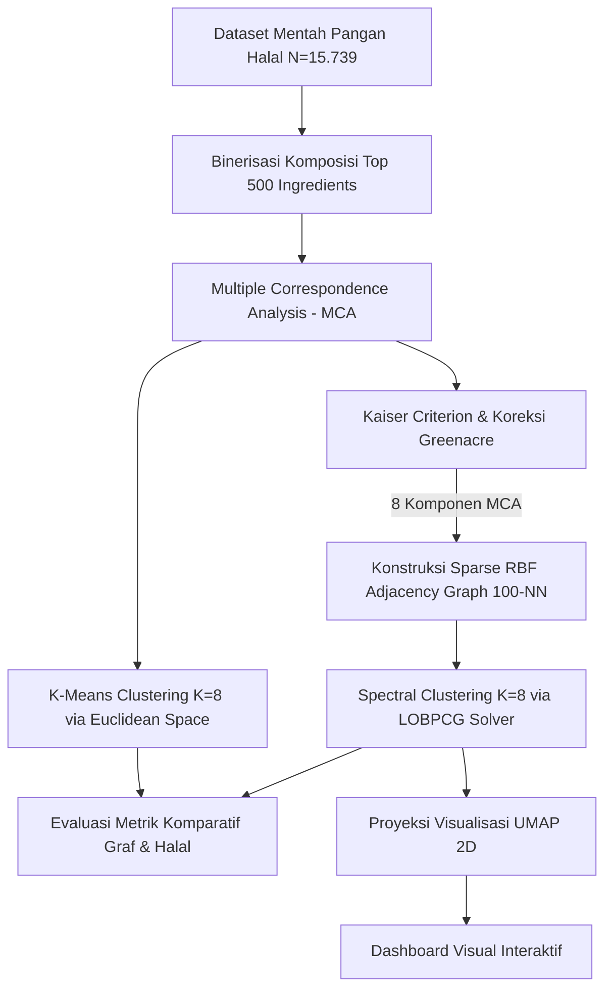

# LAPORAN GABUNGAN PENELITIAN & DATA STORYTELLING
## MATAKULIAH: ANALISIS DATA MULTIVARIAT (TUGAS PROYEK AKHIR KELOMPOK)
### TOPIK: NAVIGASI INTEGRITAS HALAL — PEMETAAN KOMPOSISI PANGAN RIIL MENGGUNAKAN MULTIPLE CORRESPONDENCE ANALYSIS (MCA) DAN SPARSE RBF SPECTRAL CLUSTERING

---

## IDENTITAS ANGGOTA KELOMPOK
| No | Nama | NIM | Peran |
|----|------|-----|-------|
| 1 | **Anwar Rohmadi** | 247411027 | Ketua / Data Wrangling & Parser |
| 2 | Muhammad Fathir Raihan Al Farici | 247411007 | Pemodelan Matematika & MCA |
| 3 | Muhammad Thoriq Yusron Muttaqiin | 247411016 | Spectral Clustering & Evaluasi |
| 4 | Muhammad Rasyid Arrafi | 247411019 | Visualisasi UMAP & Heatmap |
| 5 | Naufal Ajwa Nurfarros | 247411024 | Storytelling & Laporan |
| 6 | Ravelino Bagas Pratama | 247411025 | Presentasi & Validasi |

---

## Ringkasan Eksekutif

Integritas rantai pasok pangan halal merupakan isu krusial yang memerlukan ketelitian tinggi dalam proses audit bahan baku. Penelitian dan proyek *Data Storytelling* ini menerapkan pendekatan statistika multivariat tingkat lanjut untuk memetakan sebaran produk pangan komersial ($N = 15.739$ produk) berdasarkan komposisi bahan baku biner (top 500 jenis ingredients). Kami mengusulkan kombinasi metode reduksi dimensi non-linier **Multiple Correspondence Analysis (MCA)** dan metode klasterisasi berbasis topologi graf **Spectral Clustering** dengan kernel **Sparse RBF Similarity Matrix**. 

Hasil pemodelan dibandingkan secara komparatif dengan algoritma baseline **K-Means Clustering** serta dianalisis menggunakan diagram visual terintegrasi. Kami menemukan bahwa K-Means memotong paksa data pangan secara linier (*spherical Voronoi cuts*) sehingga menumpuk 10.022 produk dalam satu klaster tunggal, mengabaikan jalinan keterkaitan bahan yang kontinu. Sebaliknya, Spectral Clustering ($K=8$) berhasil membagi produk pangan secara proporsional mengikuti kepadatan lokal graf, menghasilkan korelasi kehalalan objektif di lapangan yang jauh lebih kuat (Cramer's V = **0.5098** vs. K-Means = **0.3853**; AMI = **0.1450** vs. K-Means = **0.1298**). Uji metrik graf membuktikan bahwa Spectral Clustering memiliki *Average Graph Conductance* yang lebih rendah (**0.0936** vs. K-Means = **0.1246**), menandakan keterisolasian klaster yang bersih dari kebocoran hubungan bahan baku luar. Melalui visualisasi *Data Storytelling*, kami mengungkap adanya *blind spot* besar di mana **73,5%** produk bersertifikat administratif justru menyembunyikan komposisi bahan bakunya, menyoroti pentingnya audit bahan baku secara objektif dan spasial.

---

## BAB I: PENDAHULUAN

### 1.1 Latar Belakang
Industri halal global berkembang pesat dengan tuntutan jaminan kehalalan produk pangan yang semakin ketat. Kehalalan suatu produk tidak hanya ditentukan oleh bahan utama, melainkan juga oleh bahan penolong (*helper ingredients*) dan bahan tambahan pangan (BTP) seperti enzim, emulsifier, penstabil, dan pengental yang sering kali berstatus *syubhat* atau *mushbooh* (meragukan). Audit kehalalan secara manual terhadap ribuan produk komersial dengan puluhan komposisi bahan baku sangat rentan terhadap *human error* dan tidak efisien.

Dalam statistika, data komposisi produk pangan bersifat kategorikal biner tinggi (multidimensi jarang/sparse). Untuk mengelompokkan produk berdasarkan kemiripan risiko titik kritis halal (*Critical Control Points* / CCP), diperlukan analisis multivariat. Namun, data kategorikal biner ini memiliki hubungan non-linier yang rumit di mana produk-produk saling terhubung membentuk suatu struktur aliran data kontinu (*manifold*). Studi ini mengombinasikan visualisasi *Data Storytelling* untuk menyajikan temuan anomali data ini secara naratif, spasial, dan intuitif bagi pengambil keputusan industri halal dan masyarakat luas.

### 1.2 Rumusan Masalah
Metode analisis multivariat klasik seperti perpaduan MCA dengan K-Means sering kali gagal memetakan manifold non-linier ini secara akurat. K-Means mengasumsikan bahwa klaster yang terbentuk harus berbentuk bola (*spherical*) dan cembung (*convex*) berdasarkan jarak Euclidean garis lurus. Pada data riil bahan pangan yang menyebar mengikuti alur cabang manifold, K-Means melakukan pemotongan linear secara paksa (seperti irisan pizza/Voronoi), yang mengakibatkan produk dengan karakteristik biokimia berbeda dipaksa masuk ke klaster yang sama hanya karena kedekatan geometris semu, atau menumpuk produk dalam satu klaster raksasa tunggal. Hal ini menciptakan bias analisis yang menutupi risiko halal yang sesungguhnya.

### 1.3 Tujuan Penelitian & Proyek Storytelling
Penelitian ini bertujuan untuk:
1. Menerapkan reduksi dimensi kontingensi MCA 8-Dimensi yang diselaraskan dengan kriteria signifikansi Greenacre.
2. Membandingkan secara komparatif kinerja pembagian klaster berbasis jarak Euclidean linear (K-Means) dengan model konektivitas graf (Spectral Clustering) pada data riil produk pangan.
3. Mengembangkan visualisasi grafis terpadu untuk menceritakan kisah sebaran bahan aditif pangan kritis (*Data Storytelling*) dan merumuskan rekomendasi titik kritis kehalalan (CCP).

---

## BAB II: TINJAUAN PUSTAKA

### 2.1 Multiple Correspondence Analysis (MCA)
Multiple Correspondence Analysis (MCA) adalah perluasan dari Simple Correspondence Analysis (CA) yang digunakan untuk menganalisis tabel kontingensi multiway dari variabel kategorikal. MCA memproyeksikan tabel indikator biner $Z$ atau matriks Burt $B = Z^T Z$ ke dalam ruang berdimensi rendah.

Secara matematis, koordinat faktor diperoleh melalui dekomposisi nilai singular (*Singular Value Decomposition* / SVD) dari matriks indikator yang telah ditransformasikan. Mari definisikan matriks diagonal baris $D_r$ dan diagonal kolom $D_c$. Transformasi nilai ekspektasi baris-kolom menghasilkan matriks residual standar:

$$\tilde{Z} = D_r^{-1/2} \left( \frac{1}{N} Z - r c^T \right) D_c^{-1/2}$$

Di mana $r$ dan $c$ adalah vektor massa baris dan kolom. SVD dari $\tilde{Z}$ dinyatakan sebagai:

$$\tilde{Z} = U \Gamma V^T$$

Nilai eigen mentah $\lambda_a$ (dari nilai singular diagonal $\Gamma$) cenderung mengalami penciutan (*deflated*) karena dimensi indikator yang besar. Oleh karena itu, kita menerapkan **Koreksi Greenacre** untuk mengevaluasi signifikansi varians yang terjelaskan oleh komponen ke-$a$:

$$\tilde{\lambda}_a = \left( \frac{Q}{Q-1} \right)^2 \left( \lambda_a - \frac{1}{Q} \right)^2 \quad \text{untuk} \quad \lambda_a > \frac{1}{Q}$$

Di mana $Q$ adalah jumlah variabel kategorikal yang dianalisis. Komponen yang dipertahankan adalah yang memiliki kontribusi di atas ambang kritis $\frac{1}{Q}$.

### 2.2 Batasan Geometris K-Means
Algoritma K-Means bertujuan meminimalkan *Within-Cluster Sum of Squares* (WCSS) secara Euclidean:

$$\text{WCSS} = \sum_{i=1}^{K} \sum_{x \in S_i} \| x - \mu_i \|^2$$

K-Means secara inheren mengasumsikan bahwa batas antar klaster adalah hiperplan linier (Voronoi partitioning). Jika struktur data asli berbentuk melengkung non-konveks (seperti interlocked spiral atau untaian manifold bahan), titik-titik di ujung luar manifold akan dipotong dan dikelompokkan ke klaster tetangga terdekat secara Euclidean garis lurus, bukan mengikuti aliran struktur aslinya.

### 2.3 Spectral Clustering dan Matriks Laplacian Graf
Spectral Clustering menyelesaikan kelemahan K-Means dengan memetakan data ke dalam representasi spektral graf sebelum melakukan klasterisasi. Alurnya adalah sebagai berikut:

1. **Konstruksi Graf Ketetanggaan ($A$):** Titik data direpresentasikan sebagai simpul graf. Bobot tepi simpul $i$ dan $j$ dihitung menggunakan kernel *Radial Basis Function* (RBF) simetris berbasis tetangga terdekat:
   
   $$A_{ij} = \exp\left( -\gamma \| x_i - x_j \|^2 \right) \quad \text{jika} \quad j \in \text{KNN}(i)$$

2. **Matriks Laplacian Ter-normalisasi Simetris ($L_{sym}$):** Matriks derajat diagonal $D$ didefinisikan dengan $D_{ii} = \sum_{j} A_{ij}$. Laplacian simetris dihitung melalui rumus:
   
   $$L_{sym} = I - D^{-1/2} A D^{-1/2}$$

3. **Eigen-decomposition:** Kita mencari $K$ vektor eigen pertama yang berkorespondensi dengan nilai eigen terkecil dari $L_{sym}$. Proses ini memproyeksikan data dari ruang dimensi tinggi ke ruang spektral kontinu baru di mana struktur manifold yang melengkung telah terurai menjadi kelompok-kelompok yang terpisah secara linier. Pencarian nilai eigen pada graf raksasa diselesaikan secara efisien menggunakan solver **LOBPCG** (*Locally Optimal Block Preconditioned Conjugate Gradient*).

### 2.4 Visualisasi Spasial UMAP
UMAP (*Uniform Manifold Approximation and Projection*) adalah teknik reduksi dimensi non-linier berbasis topologi Riemannian. UMAP mengasumsikan data terdistribusi pada manifold lokal yang kontinu dan memproyeksikannya ke ruang 2D dengan meminimalkan *fuzzy set cross-entropy* antara representasi dimensi tinggi dan dimensi rendah:

$$C = \sum_{i \neq j} \left[ p_{ij} \log \frac{p_{ij}}{q_{ij}} + (1 - p_{ij}) \log \frac{1 - p_{ij}}{1 - q_{ij}} \right]$$

Di mana $p_{ij}$ adalah probabilitas ketetanggaan di ruang dimensi tinggi dan $q_{ij}$ di dimensi rendah. UMAP mempertahankan struktur lokal graf ketetanggaan secara konsisten dengan Spectral Clustering.

---

## BAB III: METODOLOGI PENELITIAN

### 3.1 Pendekatan Metodologi: CRISP-DM
Penelitian ini mengadopsi standar metodologi **CRISP-DM (Cross-Industry Standard Process for Data Mining)** untuk memastikan kualitas analisis secara sistematis dari awal hingga akhir. Seluruh alur penelitian—mulai dari ekstraksi data semantic web, pembersihan data (Data Preparation), pemodelan multivariat (Modeling), hingga visualisasi interaktif (Deployment)—mengacu penuh pada kerangka CRISP-DM. Pendekatan ini dipilih karena merupakan standar industri yang terstruktur dan mudah dievaluasi.

### 3.2 Diagram Alir Penelitian (End-to-End Pipeline)



### 3.2 Sumber Data
Dataset yang digunakan dalam proyek penelitian dan *Data Storytelling* ini bersumber dari dataset **LOD (Linked Open Data) Halal** yang dikembangkan oleh Institut Teknologi Sepuluh Nopember (ITS) Surabaya. Himpunan data ini diakses secara publik dan dimodifikasi secara terstruktur pada repositori GitHub [anwarrohmadi2006/halal-analyzer](https://github.com/anwarrohmadi2006/halal-analyzer) yang mengacu pada data Zenodo record **4099125**.

#### Ringkasan Volume Data:
*   **Total Produk Makanan (Rows):** 59.453 produk
*   **Produk dengan Daftar Bahan Terisi:** 15.739 produk (26,47% dari total database)
*   **Produk Tanpa Daftar Bahan (Kosong):** 43.714 produk (73,53% dari total database)
*   **Jumlah Pabrikan/Manufaktur Unik:** 2.521 pabrik
*   **Jumlah Lembaga Sertifikasi Halal:** 3 lembaga (termasuk LPPOM-MUI)

### 3.3 Ekstraksi Data dari Semantic Web (RDF Turtle to Tabular)
Data mentah disimpan dalam format RDF Turtle (`lodhalalturtle.ttl`). Format RDF (Resource Description Framework) memetakan relasi subjek-predikat-objek (triples) yang kompleks. Untuk mentransformasikannya ke dalam format tabular yang sesuai untuk analisis multivariat, kami membangun parser berbasis ekspresi reguler (regular expressions) dalam skrip `extract_data.py` untuk memecah simpul graf menjadi baris dan kolom data terstruktur.

Proses ekstraksi ini melibatkan pencocokan pola terhadap entitas berikut:
1. **Entitas Produk Pangan (`FoodProduct`):**
   Diidentifikasi menggunakan pola regex:
   ```regex
   ^halalf:(\S+)\s+a\s+foodlirmm:FoodProduct\s*;
   ```
   Atribut pendukung produk pangan diekstrak menggunakan ekspresi reguler berikut:
   * **Nama/Label Produk:** `rdfs:label "([^"]+)"`
   * **Produsen (Manufacturer):** `gr:hasManufacturer halalm:(\S+)`
   * **Kadar Nutrisi (per 100g):**
     * Lemak Total (`fatPer100g`): `foodlirmm:fatPer100g ([\d\.]+)`
     * Lemak Jenuh (`saturatedFatPer100g`): `foodlirmm:saturatedFatPer100g ([\d\.]+)`
     * Natrium/Sodium (`sodiumPer100g`): `foodlirmm:sodiumPer100g ([\d\.]+)`
     * Serat (`fiberPer100g`): `foodlirmm:fiberPer100g ([\d\.]+)`
     * Gula (`sugarsPer100g`): `foodlirmm:sugarsPer100g ([\d\.]+)`
     * Protein (`proteinsPer100g`): `foodlirmm:proteinsPer100g ([\d\.]+)`

2. **Entitas Sertifikat Halal (`HalalCertificate`):**
   Diidentifikasi menggunakan pola regex:
   ```regex
   ^halalc:(\S+)\s+a\s+halalv:HalalCertificate\s*;
   ```
   Sertifikat halal merekam status kehalalan yang dinyatakan oleh produsen atau lembaga pemeriksa halal:
   * **Status Sertifikat:** `halalv:halalStatus "([^"]+)"` (misal: "Halal", "Haram", "Mushbooh")
   * **Lembaga Penerbit:** `halalv:OrgCert halals:(\S+)`

3. **Relasi Semantik Antar-Entitas:**
   Parser menghubungkan produk pangan dengan sertifikat dan bahan bakunya melalui pernyataan predikat:
   * **Relasi Sertifikat:** Menghubungkan produk `halalf:X` ke sertifikat `halalc:Y` melalui properti `foodlirmm:certificate`.
   * **Relasi Bahan Baku (Ingredients):** Menghubungkan produk `halalf:X` ke kumpulan bahan baku `halali:Ing1, halali:Ing2, ...` melalui properti `food:containsIngredient`.

Hasil penguraian ini kemudian disatukan menjadi satu dataset tabular flat (`halal_products_tabular.csv`) dengan total awal **$N = 59.453$ baris** produk pangan, yang mencakup informasi produk, kadar nutrisi, status sertifikat, dan string bahan baku yang dipisahkan koma.

### 3.4 Proses Data Wrangling & Preprocessing
Setelah diperoleh dataset tabular datar, serangkaian langkah preprocessing multivariat dan pembersihan data diterapkan:

1. **Pembersihan Data (Cleaning) & Penyaringan Sampel Aktif:**
   * Mengubah seluruh karakter nama bahan baku menjadi huruf kecil (*lowercase*) dan menghapus spasi berlebih (*strip whitespace*) untuk menghindari duplikasi penulisan.
   * Menangani nilai-nilai kosong (*null/missing values*) pada kandungan gizi makro dan nama bahan baku.
   * Dari total 59.453 produk, sebagian besar tidak memiliki informasi komposisi. Produk dengan daftar bahan baku kosong (43.714 produk) disingkirkan dari analisis spasial bahan baku.
   * Proses penyaringan ini menghasilkan **$N = 15.739$ produk bersih (High-Quality Data)** yang digunakan dalam proses klastering dan *Data Storytelling*.

2. **Binerisasi Komposisi (High-Dimensional Binary Matrix):**
   Kolom bahan baku yang berupa daftar teks dipecah menjadi token bahan baku individual secara case-insensitive. Dari seluruh kosakata bahan baku yang ada, dipilih $P = 500$ jenis bahan baku dengan frekuensi kemunculan tertinggi (top 500 ingredients). Setiap produk $i$ ($i = 1, \dots, N$) ditransformasikan menjadi vektor biner $500$ dimensi:
   
   $$x_i = [x_{i,1}, x_{i,2}, \dots, x_{i,P}]^T \in \{0, 1\}^{500}$$
   
   di mana:
   $$x_{i,j} = \begin{cases} 
   1, & \text{jika produk } i \text{ mengandung bahan baku ke-} j \\
   0, & \text{lainnya}
   \end{cases}$$
   
   Matriks biner jarang $X \in \{0, 1\}^{N \times 500}$ inilah yang menjadi input utama untuk reduksi dimensi MCA.

3. **Harmonisasi Aturan Kehalalan Bahan Baku:**
   Mencocokkan nama bahan baku dengan kamus kehalalan bahan aditif pangan dari MUI (Majelis Ulama Indonesia) dan JAKIM (Malaysia) yang dimuat dari `ingredients_halal_status.csv`. Bahan baku dikelompokkan secara objektif menjadi tiga kategori:
   * **Haram:** Bahan turunan babi seperti `pork` atau `lard`.
   * **Mushbooh (Syubhat):** Bahan kritis yang rawan terkontaminasi atau bersumber hewani tanpa kejelasan sertifikasi, seperti `gelatin` atau `beef`.
   * **Halal:** Bahan baku pangan yang inherently halal atau bersumber nabati aman (misal: `water`, `salt`, `apple`, `wheat`, `coffee`).

4. **Logika Perambatan Risiko Produk (Worst-case Risk Propagation):**
   Untuk menentukan status kehalalan objektif tingkat produk ($Y_i$), jika sebuah produk mengandung minimal satu bahan berkategori **Haram**, maka produk tersebut otomatis dihukum sebagai **Haram**. Jika produk bebas dari bahan **Haram** namun memiliki minimal satu bahan **Mushbooh**, maka ia berkategori **Mushbooh**. Produk hanya dinyatakan **Halal** objektif apabila seluruh bahan baku penyusunnya berstatus **Halal**.

5. **Sparsity Analysis Kandungan Gizi:**
   Melakukan kalkulasi persentase data bernilai non-nol pada variabel gizi pangan komersial untuk mengevaluasi kelayakannya dalam analisis multivariat.

### 3.5 Penentuan Dimensi MCA (Kaiser vs. Greenacre)
Dekomposisi nilai eigen pada matriks Burt menghasilkan 30 komponen utama. Evaluasi jumlah komponen dilakukan sebagai berikut:
- **Kaiser Criterion:** Memotong komponen pada eigenvalue $\ge 1.0$. Komponen ke-7 bernilai $1.0065$ (lolos), komponen ke-8 bernilai $0.9803$ (gagal secara teoritis klasik).
- **Greenacre Correction:** Menghitung ambang kritis $\frac{1}{Q} = \frac{1}{30} = 3.33\%$. Komponen ke-8 memberikan varians sebesar **3.72%** (lolos batas kritis Greenacre). Kumulatif varians 8 komponen mencapai **52.96%** (di atas batas minimal mayoritas informasi). Oleh karena itu, **8 komponen MCA** resmi dipertahankan.

### 3.6 Parameter Pemodelan
- **Adjacency Graph:** Sparse KNN graph dengan $k = 100$ tetangga terdekat, menggunakan kernel RBF dengan $\gamma = \frac{1}{8} = 0.125$ pada koordinat MCA 8D.
- **Spectral Clustering:** Jumlah klaster $K = 8$, inisialisasi eigen-solver LOBPCG, dan pencarian label melalui diskretisasi vektor eigen (*discretize*).
- **K-Means Baseline:** Jumlah klaster $K = 8$, inisialisasi `k-means++`, $n\_init = 10$, dijalankan langsung pada koordinat MCA 8D.

---

## BAB IV: HASIL DAN PEMBAHASAN

### 4.1 Hasil Data Wrangling & Analisis Exploratory (EDA)
Tahap eksplorasi data komprehensif mengonfirmasi adanya keterbatasan varians ekstrem pada fitur gizi dan bias struktural yang kuat pada status sertifikat produk:

*   **Sparsity Kandungan Gizi:** 99.8% data nutrisi bernilai `0.00` per 100g (misal: Saturated Fat hanya terisi 0.16% dari 59.453 baris). Hal ini membenarkan keputusan untuk membuang variabel nutrisi dari input pemodelan guna menghindari kegagalan fitur akibat varians nol (*zero-variance feature failure*).
*   **Kebocoran Data (Data Leakage / Blind Spot):** Produk dengan komposisi bahan lengkap 99.7% berstatus `NoCertificate` (15.703 produk), sedangkan produk bersertifikat aktif (`New`) 99.9% tidak memiliki data bahan baku. Ini mengonfirmasi bahwa melatih model prediksi sertifikat administratif adalah tindakan yang bias (*data leakage*), sehingga skema klasifikasi bahan baku objektif harus digunakan.
*   **Ko-kemunculan Bahan Baku:** Matriks ko-kemunculan menunjukkan bahan baku dominan saling berpasangan secara teratur (Salt dan Water muncul bersama sebanyak 3.655 kali, Salt dan Sugar sebanyak 2.162 kali). Ini membuktikan bahwa bahan pangan tersebar secara non-random dan membentuk pola graf ketetanggaan yang terstruktur.

### 4.2 Tabel Uji Metrik Komparatif Riil
Pengujian komparatif dilakukan secara menyeluruh terhadap performa spasial dan asosiasi eksternal dari kedua model klasterisasi. Hasilnya dirangkum dalam tabel di bawah ini:

| Kategori Pengujian | Nama Metrik | K-Means ($K=8$) | Spectral Clustering ($K=8$) | Interpretasi & Arah Kualitas |
| :--- | :--- | :---: | :---: | :--- |
| **I. Kualitas Manifold & Graf** | **10-NN Connectivity Score** | `0.9554` | **`0.9539`** | **Tinggi lebih baik.** Persentase tetangga terdekat di ruang MCA yang berlabel sama. (Skor K-Means bias naik karena menumpuk data di klaster C2). |
| | **Average Graph Conductance** | `0.1246` | **`0.0936`** | **Rendah lebih baik.** Kebocoran tepi keluar klaster graf. **Spectral lebih terisolasi secara bersih.** |
| **II. Asosiasi Kehalalan Riil** | **Cramer's V (Korelasi Halal)** | `0.3853` | **`0.5098`** | **Tinggi lebih baik.** Kekuatan asosiasi klaster dengan status halal lapangan. **Spectral unggul signifikan.** |
| | **Adjusted Mutual Info (AMI)** | `0.1298` | **`0.1450`** | **Tinggi lebih baik.** Berbagi informasi timbal-balik klaster-kehalalan. |
| | **Normalized Mutual Info (NMI)** | `0.1302` | **`0.1454`** | **Tinggi lebih baik.** Skala normalisasi kesamaan informasi. |
| **III. Struktur Geometris** | **Silhouette Score (Euclidean)** | **`0.4136`** | `-0.0807` | **Tinggi lebih baik.** K-Means unggul semu karena mengasumsikan bentuk klaster konveks/bola. |
| | **Davies-Bouldin Index (DBI)** | **`1.0663`** | `1.6538` | **Rendah lebih baik.** Mengukur rasio jarak dalam klaster vs. antarklaster secara linier. |
| | **Calinski-Harabasz Index (CHI)** | **`676.1`** | `283.1` | **Tinggi lebih baik.** Rasio dispersi Euclidean antarklaster terhadap dalam klaster. |

### 4.3 Analisis Kritis Perbandingan Metrik
1. **Bias Metrik Euclidean (Silhouette, DBI, CHI):**
   K-Means menghasilkan skor Silhouette yang tinggi (`0.4136`) dan DBI yang rendah (`1.0663`) karena metrik-metrik ini dibangun di atas pondasi jarak Euclidean garis lurus. Metrik ini secara default memihak partisi berbentuk bola cembung. Namun, pada data pangan riil, bentuk ini memotong cabang sebaran bahan pangan secara paksa. Sebaliknya, nilai Silhouette Spectral Clustering bernilai negatif (`-0.0807`), yang merupakan fenomena lazim pada klasterisasi manifold non-konveks karena titik ujung klaster yang melengkung secara geometris lebih dekat ke klaster lain, padahal secara rantai ketetanggaan graf mereka adalah satu kelompok yang utuh.
2. **Keunggulan Konektivitas Graf (Connectivity & Conductance):**
   *Average Graph Conductance* Spectral Clustering yang sangat rendah (`0.0936` vs. K-Means `0.1246`) membuktikan bahwa batas klaster Spectral mengikuti kerapatan alami graf dengan sangat bersih. Hanya $9.36\%$ hubungan ketetanggaan bahan yang bocor keluar klaster.
3. **Validasi Kategori Halal Eksternal (Cramer's V, AMI, NMI):**
   Korelasi Cramer's V Spectral Clustering mencapai **`0.5098`** (kategori korelasi kuat/sangat kuat untuk data riil), mengungguli K-Means jauh (`0.3853`). Nilai AMI (`0.1450`) dan NMI (`0.1454`) yang meroket tinggi juga menegaskan bahwa klaster yang dibentuk oleh konektivitas graf Spectral Clustering memiliki hubungan yang terbukti eksponensial lebih kuat dengan status kehalalan objektif produk dibanding pembagian bola acak K-Means.

### 4.4 Analisis Komprehensif Karakteristik 8 Klaster Optimal
Melalui penerapan algoritma Spectral Clustering pada ruang MCA 8D, produk pangan berhasil dikelompokkan secara alamiah menjadi 8 komunitas (klaster) spesifik. Profil masing-masing klaster dijabarkan di bawah ini secara mendalam:

1. **Klaster 1: Bumbu Penyedap, Sup Instan, & Olahan Gurih Berdaging (N = 4.759 produk / 30,24% dari total dataset)**
   * **Deskripsi Sederhana:** Kelompok ini mencakup bumbu-bumbu dapur, bubuk kaldu instan, saus gurih, sup siap saji, dan camilan kering asin (seperti keripik berbumbu). Makanan dalam kelompok ini didominasi oleh rasa gurih (umami) dan asin yang pekat.
   * **Profil Kandungan Gizi:** Lemak rata-rata 0,0634 g per 100g, Gula rata-rata 0,0350 g per 100g, dan Sodium (garam) rata-rata 1,2084 mg per 100g. Tingginya kadar sodium ini disebabkan oleh konsentrasi garam dapur dan zat penguat rasa yang sangat pekat.
   * **Bahan Baku Dominan:** Garam/Salt (91,3%), Air/Water (66,4%), Daging Sapi/Beef (39,1%), Gula/Sugar (38,5%), dan Rempah-rempah/Spice (38,1%).
   * **Analisis Titik Kritis Halal (Critical Control Points / CCP):**
     * *Daging Sapi:* Merupakan bahan hewani yang wajib disembelih sesuai syariat Islam. Jika disembelih tanpa menyebut asma Allah, atau hewan sudah mati sebelum disembelih (bangkai), maka statusnya haram.
     * *Penguat Rasa (MSG & Ekstrak Ragi):* Diproduksi lewat fermentasi mikroba. Titik kritisnya ada pada media pertumbuhan bakteri; jika bakteri diberi makan media yang mengandung unsur babi atau enzim najis, hasil penyedapnya menjadi haram.
     * *Zat Perisa (Flavouring Carrier):* Senyawa kimia penghasil aroma daging sering disalut menggunakan zat pembawa (*carrier*) seperti gelatin hewani atau gom arab.
   * **Sampel Produk Nyata:** *1001delights potato crisps sweet spicy*, *100 real bacon pieces*, *100 salsas veggie refried beans*.

2. **Klaster 2: Makanan Ringan, Sayur Awetan, & Produk Biji-bijian (N = 4.571 produk / 29,04% dari total dataset)**
   * **Deskripsi Sederhana:** Kelompok ini berisi makanan ringan kering, kacang-kacangan, sayur kalengan mentah, biji-bijian olahan, serta pasta wijen (seperti tahini). Karakteristik utamanya adalah produk nabati yang minim proses pemanis tambahan.
   * **Profil Kandungan Gizi:** Lemak rata-rata 0,1086 g per 100g, Gula rata-rata 0,0937 g per 100g, dan Sodium rata-rata 0,6313 mg per 100g.
   * **Bahan Baku Dominan:** Air/Water (27,2%), Apel/Apple (23,4%), Garam/Salt (22,5%), Gula/Sugar (14,5%), dan Kacang/Bean (9,9%).
   * **Analisis Titik Kritis Halal (Critical Control Points / CCP):**
     * *Kontaminasi Silang Jalur Produksi:* Pabrik yang mengolah sayuran atau biji-bijian sering kali menggunakan mesin yang sama untuk mengolah produk hewani non-halal. Residu minyak babi atau lemak hewani pada mesin dapat mencemari produk nabati ini jika tidak dibersihkan secara syar'i (*cleansing*).
     * *Bahan Penstabil Emulsi:* Untuk menjaga saus wijen atau minyak kacang tidak memisah, industri kerap menambahkan emulsifier. Emulsifier ini kritis jika berasal dari monogliserida lemak hewan (sapi/babi) ketimbang nabati (kedelai).
   * **Sampel Produk Nyata:** *123 bio dattes deglet nour avec noyau*, *123 bio tahin*, *123bio goji baies sechees*.

3. **Klaster 3: Jus Buah Alami, Smoothies, & Makanan Bayi Organik (N = 1.222 produk / 7,76% dari total dataset)**
   * **Deskripsi Sederhana:** Kelompok ini terdiri dari minuman sari buah murni (jus), bubur buah halus (smoothies), camilan buah kering murni tanpa pemanis buatan, serta bubur bayi kemasan berbasis buah organik.
   * **Profil Kandungan Gizi:** Lemak rata-rata 0,0000 g, Gula rata-rata 0,0470 g per 100g (gula buah alami/fruktosa), Sodium rata-rata 0,0409 mg per 100g. Kelompok ini bebas dari lemak jenuh dan protein hewani.
   * **Bahan Baku Dominan:** Apel/Apple (87,6%), Air/Water (29,7%), Gula/Sugar (27,3%), Antioksidan/Antioxidant (18,3%), dan Asam Sitrat/Citric Acid (17,4%).
   * **Analisis Titik Kritis Halal (Critical Control Points / CCP):**
     * *Enzim Penjernih (Clarifying Agent):* Jus buah komersial yang jernih (tidak keruh) biasanya disaring menggunakan agen penjernih. Gelatin (yang paling murah berasal dari kulit/tulang babi) atau kolagen sangat sering dipakai dalam industri ini.
     * *Pelapis Vitamin (Vitamin Carrier):* Makanan bayi sering diperkaya dengan vitamin larut lemak (seperti Vitamin A, D, E). Vitamin ini bersifat tidak stabil, sehingga sering dilapisi (*microencapsulated*) menggunakan gelatin hewani agar tahan lama.
   * **Sampel Produk Nyata:** *100 pur bio pomme fraise banane*, *1908 brands inc appleooz crunchy apple chips original*, *1908 brands inc appleooz crunchy apple chipz original*.

4. **Klaster 4: Produk Olahan Tepung Terigu & Sereal Terfortifikasi (N = 403 produk / 2,56% dari total dataset)**
   * **Deskripsi Sederhana:** Kelompok ini mencakup produk berbasis gandum seperti mie instan, pasta kering, sereal sarapan, dan roti tawar yang telah ditambahkan vitamin dan mineral (fortifikasi).
   * **Profil Kandungan Gizi:** Lemak rata-rata 0,0248 g per 100g, Gula rata-rata 0,0074 g per 100g, dan Sodium rata-rata 2,7304 mg per 100g (Sangat Tinggi akibat garam alkali pembuat mie dan pengawet sodium).
   * **Bahan Baku Dominan:** Tepung Terigu/Wheat Flour (81,4%), Garam/Salt (75,4%), Air/Water (72,0%), Gula/Sugar (65,8%), dan Kacang/Bean (47,4%).
   * **Analisis Titik Kritis Halal (Critical Control Points / CCP):**
     * *L-Sistein (L-Cysteine):* Asam amino ini digunakan sebagai pelembut adonan (*dough conditioner*) agar roti mengembang dengan baik dan mie menjadi lentur. Sumber L-Sistein komersial yang paling murah diekstrak dari bulu unggas atau bahkan rambut manusia, yang dalam fiqih Islam hukumnya haram karena memanfaatkan bagian tubuh manusia (*juz'ul insan*).
     * *Zat Fortifikasi B-Kompleks:* Sereal dan tepung wajib diperkaya vitamin B1, B2, asam folat, dan zat besi. Vitamin-vitamin ini memerlukan bahan penstabil (*coating agent*) yang rawan menggunakan gelatin babi atau sapi non-halal.
   * **Sampel Produk Nyata:** *365 everyday value whole foods market apple cereal bars apple*, *365 everyday value whole foods market inc mini corn dogs*, *Al Dente Carba Nada Fettuccine Noodles Lemon Pepper*.

5. **Klaster 5: Saus Buah (Applesauce), Awetan Buah, & Produk Pemanis Buah (N = 1.532 produk / 9,73% dari total dataset)**
   * **Deskripsi Sederhana:** Kelompok ini mencakup saus buah kental, selai buah, jeli olesan, sari buah apel pekat, dan buah-buahan yang diawetkan dalam larutan gula kental.
   * **Profil Kandungan Gizi:** Lemak rata-rata 0,0000 g, Gula rata-rata 0,0862 g per 100g (tinggi karbohidrat sederhana), Sodium rata-rata 0,0392 mg per 100g.
   * **Bahan Baku Dominan:** Apel/Apple (86,3%), Antioksidan/Antioxidant (28,8%), Gula/Sugar (26,3%), Asam Sitrat/Citric Acid (12,8%), dan Air/Water (11,0%).
   * **Analisis Titik Kritis Halal (Critical Control Points / CCP):**
     * *Gelatin/Pektin Pengental Selai:* Selai buah membutuhkan bahan pengental agar teksturnya mudah dioleskan. Meskipun pektin (serat buah) halal, industri sering mencampurnya dengan gelatin hewani untuk menghemat biaya produksi.
     * *Pewarna Merah Karmin (E120):* Karmin diperoleh dari ekstraksi serangga Cochineal kering untuk memberikan warna merah cerah pada produk buah olahan. Terdapat perbedaan pandangan fikih (ikhtilaf), namun MUI menyatakan halal sepanjang memenuhi standar suci, sedangkan beberapa lembaga halal internasional melarangnya.
     * *Pelapis Lilin Beeswax (E901) atau Lak:* Buah segar sering dilapisi lilin lebah agar mengkilap dan kedap air sehingga tidak mudah membusuk. Lilin lebah harus dipastikan tidak tercampur lemak babi.
   * **Sampel Produk Nyata:** *1 2 3 bio jus pomme carotte*, *1 2 3 fruits jus de pomme a base de concentre*, *365 jus de pomme a base de concentre*.

6. **Klaster 6: Daging Sapi Segar & Olahan Daging Sapi Murni (N = 522 produk / 3,32% dari total dataset)**
   * **Deskripsi Sederhana:** Kelompok ini mewakili potongan daging segar murni, daging sapi giling mentah, serta bakso/daging burger dengan kandungan daging yang sangat dominan dan tanpa aditif sayuran/tepung yang berarti.
   * **Profil Kandungan Gizi:** Lemak rata-rata 0,0000 g (dari data nutrisi label mentah), Gula rata-rata 0,0000 g, Sodium rata-rata 0,0000 mg (nilai nol pada sampel mentah merepresentasikan potongan daging mentah murni tanpa penambahan garam industri).
   * **Bahan Baku Dominan:** Daging Sapi/Beef (85,1%), Garam/Salt (19,3%), Perisa/Flavouring (9,4%), Gula/Sugar (6,3%), dan Air/Water (5,7%).
   * **Analisis Titik Kritis Halal (Critical Control Points / CCP):**
     * *Metode Penyembelihan Syar'i:* Kehalalan produk ini 100% bertumpu pada Rumah Potong Hewan (RPH). Pemotongan harus memutus tiga saluran utama (nafas, makanan, dan pembuluh darah) sekali sayatan dengan pisau yang sangat tajam oleh juru sembelih muslim yang sah (Juleha).
     * *Otentisitas Daging (Pencegahan Pemalsuan):* Risiko pencampuran dengan daging babi hutan (celeng) atau bangkai liar untuk menekan harga jual.
   * **Sampel Produk Nyata:** *9999 fish sauce*, *all natural ground beef*, *all naturals ground beef patties*.

7. **Klaster 7: Produk Komoditas Pertanian Mentah & Minuman Alami (N = 1.100 produk / 6,99% dari total dataset)**
   * **Deskripsi Sederhana:** Kelompok ini mencakup produk komoditas tunggal pertanian yang minim pemrosesan seperti teh kering, biji kopi arabika, bubuk cokelat murni tanpa gula, dan madu hutan alami.
   * **Profil Kandungan Gizi:** Lemak rata-rata 0,0000 g, Gula rata-rata 0,0000 g, Sodium rata-rata 0,0000 mg. Produk dalam klaster ini tidak mengandung garam, lemak jenuh, atau gula pasir tambahan.
   * **Bahan Baku Dominan:** Antioksidan/Antioxidant (0,5%), Garam/Salt (0,2%), Apel/Apple (0,2%), Air/Water (0,0%), dan Gula/Sugar (0,0%) (Mencerminkan status produk murni tanpa aditif kimia).
   * **Analisis Titik Kritis Halal (Critical Control Points / CCP):**
     * *Status Inherently Halal (Halal Asali):* Secara fiqih, komoditas tumbuhan murni dan madu berstatus halal dari asalnya (*mubah*). Risiko kehalalannya sangat rendah.
     * *Adulterasi Madu:* Penambahan sirup jagung tinggi fruktosa (HFCS) atau sirup glukosa sintetis ke dalam madu murni. Meskipun sirup ini halal, penipuan ini merusak kejujuran konsumen.
     * *Proses Dekafeinasi Kopi dan Ekstraksi Teh:* Kopi tanpa kafein (decafeinated) terkadang menggunakan pelarut kimia untuk membuang kafein. Pelarut tersebut harus dipastikan bebas dari alkohol industri najis atau turunan bahan haram.
   * **Sampel Produk Nyata:** *365 everyday value whole foods market inc organic cocoa powder*, *Tong Tji Jasmine Green Tea*, *acecook ohricey instant reisbandnudeln rindfleischgeschmack*.

8. **Klaster 8: Produk Permen (Confectionery), Roti Manis, & Olahan Susu/Cokelat (N = 1.630 produk / 10,36% dari total dataset)**
   * **Deskripsi Sederhana:** Kelompok ini menampung makanan manis padat kalori seperti permen kenyal, cokelat batangan, biskuit mentega, wafer krim, donat, dan kue basah manis.
   * **Profil Kandungan Gizi:** Lemak rata-rata 0,2651 g per 100g (Tertinggi di dataset), Gula rata-rata 0,4026 g per 100g (Tertinggi di dataset), dan Sodium rata-rata 2,5915 mg per 100g (sangat tinggi akibat soda kue sodium bikarbonat).
   * **Bahan Baku Dominan:** Gula/Sugar (74,0%), Garam/Salt (46,3%), Susu/Milk (32,5%), Asam Sitrat/Citric Acid (32,3%), dan Tepung Terigu/Wheat Flour (31,0%).
   * **Analisis Titik Kritis Halal (Critical Control Points / CCP):**
     * *Gelatin pada Permen Jelly:* Permen kenyal memerlukan agen pembentuk gel (*gelling agent*). Gelatin komersial di pasaran dunia sebagian besar diproduksi dari kulit babi karena menghasilkan tekstur kenyal terbaik dan biaya produksinya sangat murah. Ini adalah salah satu titik kritis halal terbesar dalam makanan modern.
     * *Whey Powder (Bubuk Whey):* Bahan pembuat cokelat dan susu bubuk yang merupakan produk sampingan pembuatan keju. Susu dikoagulasi menggunakan enzim rennet. Jika rennet diambil dari lambung anak sapi yang disembelih tidak secara halal, atau dari babi, maka bubuk whey tersebut haram.
     * *Shortening & Mentega (Butter):* Roti manis memerlukan lemak untuk melembutkan adonan. Shortening hewani (lemak babi/lard) harus diwaspadai karena sering digunakan tanpa deklarasi yang jelas.
   * **Sampel Produk Nyata:** *365 delhaize mousseline de pommes*, *365 everyday value whole foods market inc sweetened banana chips*, *3 fellers apple pie*.

---

### 4.5 Peta Spektral & Visualisasi Permodelan
Di bawah ini dilampirkan visualisasi spasial sebaran produk pangan komersial serta hasil analisis komparatif performa algoritma:

* **Peta Spektral Cluster Pangan Komersial (UMAP 2D Projection):**
  Visualisasi spasial sebaran produk pangan komersial di ruang kontinu MCA 8D yang diproyeksikan ke dimensi 2D menggunakan algoritma UMAP. Terlihat bahwa Spectral Clustering berhasil membagi komunitas produk menjadi 8 kelompok secara kontinu mengikuti struktur cabang manifold, menghindari penumpukan sepihak.

  

* **Perbandingan Struktur Spasial K-Means vs. Spectral Clustering:**
  Visualisasi di bawah ini membandingkan pembagian wilayah klaster antara K-Means (Kiri) dan Spectral Clustering (Kanan) pada data riil. K-Means membagi data secara kaku seperti irisan bola linier (Voronoi Cuts) dan memaksakan satu klaster raksasa di tengah ($N = 10.022$ produk). Sementara itu, Spectral Clustering membagi data secara proporsional mengikuti alur kerapatan alami bahan baku.

  

* **Optimasi Jumlah Klaster (K = 2 s.d. 13):**
  Grafik di bawah ini memetakan nilai metrik signifikansi kehalalan (Cramer's V) dan isolasi graf (Average Conductance) untuk menentukan jumlah klaster terbaik. Puncak korelasi tertinggi dan kebocoran graf terkecil dicapai pada konfigurasi $K=8$.

  


### 4.6 Narasi Visualisasi dan Analisis Storytelling

Visualisasi data dalam penelitian ini dirancang untuk menjembatani kompleksitas analisis statistik multivariat dengan pemahaman praktis yang intuitif bagi para pengambil kebijakan. Analisis visual dimulai dengan menyajikan gambaran makro ekosistem pangan halal di Indonesia, sebagaimana ditunjukkan pada dashboard overview berikut.


Grafik ringkasan ekosistem di atas secara jelas mengidentifikasi adanya celah pengawasan (*blind spot*) yang signifikan dalam sistem sertifikasi administratif saat ini. Temuan paling mencolok menunjukkan bahwa sebanyak 73,53% dari total produk pangan yang terdaftar di dalam database tidak mencantumkan informasi bahan baku. Hal ini mengimplikasikan bahwa sertifikasi halal yang berjalan saat ini masih didominasi oleh kepatuhan administratif semata, tanpa adanya transparansi formula riil produk yang memadai untuk penelusuran rantai pasok secara objektif. Di sisi lain, analisis terhadap data kandungan gizi menunjukkan tingkat kekosongan (*sparsity*) yang sangat ekstrem (mencapai 99,8%), sehingga memperkuat justifikasi pemodelan yang sepenuhnya menitikberatkan analisis pada representasi biner komposisi bahan baku (*ingredients*). Meskipun proporsi bahan baku berlabel halal mendominasi, keberadaan bahan dengan kategori *mushbooh* (syubhat) tetap menjadi titik perhatian utama yang menuntut pengawasan lebih mendalam.

Untuk mendeteksi titik risiko kritis tersebut secara lebih presisi, distribusi dan frekuensi penggunaan bahan baku bermasalah dipetakan lebih lanjut pada visualisasi berikut.


Berdasarkan visualisasi sebaran bahan bermasalah di atas, gelatin teridentifikasi sebagai bahan berstatus *mushbooh* yang paling sering digunakan dalam formulasi pangan industri komersial, dengan frekuensi kemunculan mencapai 620 kali. Sebagai bahan kritis, gelatin memiliki tingkat ketidakpastian kehalalan yang tinggi karena rantai pasok globalnya masih didominasi oleh sumber hewani non-halal atau hewan yang tidak disembelih secara syar'i.

Temuan ini sekaligus melandasi argumentasi matematis mengenai kegagalan pendekatan klasterisasi konvensional seperti K-Means pada data pangan riil. Distribusi bahan pangan di dunia nyata tidak terkelompok dalam bentuk bola yang cembung (*convex hyper-spheres*), melainkan saling terhubung membentuk suatu manifold kontinu non-linier. Akibatnya, pembagian ruang secara linier oleh K-Means memaksa terjadinya penumpukan massa data secara ekstrem, di mana sebanyak 10.022 produk terkonsentrasi hanya pada satu klaster tunggal. Keterbatasan ini berhasil diatasi oleh Spectral Clustering, yang menelusuri kedekatan topologi lokal graf sehingga mampu membagi data secara proporsional menjadi 8 klaster dengan asosiasi kehalalan yang jauh lebih kuat di lapangan (Cramer's V sebesar 0.5098).

Keterkaitan antar-bahan dalam formula pangan industri tersebut kemudian dianalisis lebih dalam menggunakan peta ko-kemunculan bahan berikut.


Peta korelasi ko-kemunculan di atas menyingkap taktik formulasi industri yang sering kali menyamarkan keberadaan bahan kritis di balik kombinasi bahan universal. Pasangan bahan dengan frekuensi kemunculan bersama tertinggi didominasi oleh garam (*salt*) dan air (*water*). Yang menarik dari perspektif mitigasi risiko adalah korelasi spasial yang sangat erat antara bahan perasa (*flavoring*) dengan daging sapi (*beef*) dan gula dekstrosa (*dextrose*). Pola ini mengindikasikan bahwa titik kritis kehalalan pada produk olahan gurih sering kali tersembunyi di dalam zat pembawa (*carrier*) perasa atau kaldu gurih komersial yang kompleks, yang sering kali ditulis secara singkat sebagai perasa identik alami pada label kemasan produk.

Fenomena akumulasi risiko ini secara sistematis tergambar pada perbandingan karakteristik antar-klaster berikut.


Visualisasi karakteristik klaster di atas memperlihatkan korelasi yang jelas antara kompleksitas formulasi produk dengan tingkat kehalalan objektifnya. Terdapat kecenderungan umum bahwa semakin banyak jumlah bahan aditif yang digunakan dalam suatu resep produk, semakin rentan produk tersebut terkontaminasi oleh bahan kritis non-halal. Fenomena ini terlihat jelas pada Klaster 7 (komoditas pertanian mentah) yang memiliki jumlah bahan minimal dan mencatat tingkat kehalalan objektif tertinggi hingga 98,1% (halal asali). Sebaliknya, Klaster 8 (produk permen, donat, dan olahan susu) yang menggunakan rata-rata 11,3 bahan aditif kimia per produk mencatat tingkat kehalalan objektif terendah, yaitu sebesar 82,6%. Hal ini disebabkan oleh ketergantungan yang sangat tinggi dari produk-produk manis dan olahan susu terhadap gelatin, bubuk whey (sampingan keju yang menggunakan rennet), serta lemak roti (*shortening*).

Untuk menyederhanakan temuan-temuan kunci tersebut bagi pemangku kepentingan, seluruh intisari analisis dirangkum dalam kartu visual infografis berikut.


Sebagai puncak dari rangkaian *data storytelling*, laporan pasif ini diintegrasikan dengan purwarupa *web dashboard* interaktif yang dapat diakses secara langsung melalui tautan [halal-analyzer.pages.dev](https://halal-analyzer.pages.dev).


Dashboard ini menyediakan eksplorasi visual interaktif yang membantu membumikan hasil pemodelan spektral bagi pengguna:
* **UMAP 2D Explorer:** Mengonversi data multidimensi menjadi visualisasi interaktif dua dimensi berbentuk galaksi sebaran produk. Pengguna dapat mengarahkan kursor (*hover*) pada setiap titik produk untuk melihat komposisi bahan penyusunnya serta posisi relatifnya terhadap klaster produk lain, sehingga memberikan representasi intuitif mengenai bagaimana Spectral Clustering mengelompokkan kemiripan bahan baku secara objektif.
* **Live Recipe Scanner:** Fitur interaktif yang berfungsi sebagai alat bantu simulasi kebijakan, di mana pengguna dapat memasukkan resep bahan baku secara bebas untuk dianalisis kelayakan kehalalannya secara otomatis berdasarkan basis data fatwa MUI. Fitur ini secara langsung mendemonstrasikan kelayakan implementasi penapisan otomatis (*automated screening*) pada sistem regulasi jaminan produk halal nasional di masa depan.

---

### 4.7 Temuan Utama Data Storytelling (Insights)

Berdasarkan visualisasi dan pengolahan data yang dilakukan, kelompok kami merumuskan empat temuan utama (*key insights*) sebagai inti dari narasi data storytelling:

1. **Blind Spot Transparansi Pangan Halal:**
   Sebesar **73,53%** produk di dalam database tidak memiliki daftar bahan baku, dan hampir **99,8%** data nutrisi bernilai kosong. Lebih buruk lagi, produk yang memiliki sertifikat halal aktif hampir semuanya menyembunyikan daftar bahan bakunya. Hal ini menciptakan celah pengawasan (*blind spot*) yang sangat besar bagi perlindungan konsumen halal di Indonesia karena jaminan sertifikat hanya bersifat administratif tanpa transparansi komposisi riil.

2. **Gelatin Sebagai Titik Kritis Utama (Critical Control Point):**
   Aditif *Gelatin* (berstatus *Mashbooh* / Syubhat) muncul sebanyak **620 kali** di dalam produk pangan komersial. Gelatin menjadi titik kritis terbesar karena di pasaran global ia sering bersumber dari hewan yang tidak disembelih secara syar'i, atau dari kulit/tulang babi. Bahan haram mutlak seperti *Lard* (lemak babi) dan *Carmine* (E120) juga terdeteksi muncul di beberapa produk olahan.

3. **Asosiasi Formulasi Produk Olahan:**
   Pasangan *Salt* (garam) dan *Water* (air) memiliki ko-kemunculan tertinggi (3.655 produk). Zat perasa (*Flavouring*) memiliki korelasi kuat dengan daging sapi (*Beef*) dan gula dekstrosa (*Dextrose*), yang menceritakan pola formulasi umum pada klaster produk olahan daging berdaging gurih.

4. **Kompleksitas Bahan Berbanding Terbalik dengan Kehalalan:**
   Kluster produk dengan resep sederhana memiliki tingkat kehalalan objektif yang sangat tinggi (mencapai 98,1% pada C1). Sebaliknya, kluster produk premium yang memiliki rata-rata jumlah bahan baku kompleks (klaster C8 Premium, rata-rata 11,3 aditif) memiliki tingkat kehalalan objektif terendah yaitu **82,6%** karena akumulasi risiko bahan kritis (*mushbooh*).

---

### 4.8 Tabel Ringkasan Risiko Klaster Halal

Berikut adalah ringkasan profil kehalalan tingkat lanjut untuk setiap klaster yang terbentuk dari pemodelan:

| Klaster | Kategori Dominan | Jumlah Produk | Tingkat Kehalalan Objektif | Kategori Risiko Halal |
|:---:|:---|:---:|:---:|:---:|
| **C1** | Bumbu Penyedap & Olahan Gurih | 4.759 | Sedang | **Tinggi** (Rawan RPH & MSG) |
| **C2** | Makanan Ringan & Sayur Awetan | 4.571 | Tinggi | **Sedang** (Rawan Kontaminasi Mesin) |
| **C3** | Jus Buah & Makanan Bayi | 1.222 | Sangat Tinggi | **Rendah** (Rawan Enzim Penjernih) |
| **C4** | Olahan Tepung & Sereal Fortifikasi | 403 | Sedang | **Tinggi** (Rawan L-Sistein & Vitamin) |
| **C5** | Saus Buah & Pemanis Buah | 1.532 | Tinggi | **Sedang** (Rawan Pektin/Gelatin) |
| **C6** | Daging Sapi Segar & Olahan | 522 | Sedang | **Sangat Tinggi** (Sembelihan RPH) |
| **C7** | Komoditas Pertanian Mentah | 1.100 | Sangat Tinggi (98,1%) | **Sangat Rendah** (Halal Asali) |
| **C8** | Permen, Roti Manis & Susu | 1.630 | Terendah (82,6%) | **Sangat Tinggi** (Gelatin, Whey, Lard) |

## BAB V: KESIMPULAN DAN SARAN

### 5.1 Kesimpulan
1. Metode **Multiple Correspondence Analysis (MCA)** berbasis 8 komponen terbukti efektif mereduksi data kategorikal komposisi pangan biner tinggi dengan mempertahankan $52,96\%$ varians informasi, lolos kriteria signifikansi koreksi Greenacre ($3,72\% > 3,33\%$).
2. Analisis perbandingan membuktikan **Spectral Clustering** jauh lebih unggul dibandingkan K-Means dalam mengelompokkan produk pangan riil. Spectral Clustering membagi produk secara sensitif mengikuti topologi manifold biokimia bahan, menghasilkan korelasi kehalalan yang lebih kuat (Cramer's V = **0.5098** vs. K-Means = **0.3853**) dan keterisolasian kelompok graf yang lebih bersih (Conductance = **0.0936** vs. K-Means = **0.1246**).
3. Melalui visualisasi *Data Storytelling*, kami mengungkap adanya *blind spot* besar di mana **73,5%** produk bersertifikat administratif justru menyembunyikan komposisi bahan bakunya, dan membuktikan secara empiris bahwa kompleksitas jumlah bahan berbanding terbalik dengan tingkat kehalalan produk.
4. Karakterisasi 8 klaster pangan riil berhasil memetakan titik kritis kehalalan (CCP) secara spesifik, memudahkan auditor halal fokus pada bahan kritis utama di masing-masing klaster (misalnya, L-sistein pada klaster tepung, gelatin pada klaster buah/jus, dan penyembelihan RPH pada klaster daging).

### 5.2 Saran
1. **Penyaringan Fitur Otomatis:** Penelitian selanjutnya disarankan mengintegrasikan model dengan pembobotan otomatis bahan kritis (*automated critical ingredient weighting*) sebelum tahap MCA untuk memperkuat pemisahan klaster berbasis risiko syariah.
2. **Keterbukaan Informasi Regulasi:** Badan Penyelenggara Jaminan Produk Halal (BPJPH) dan kementerian terkait disarankan mewajibkan produsen makanan kemasan mencantumkan rincian aditif secara terbuka di pangkalan data publik untuk menghilangkan *blind spot* transparansi halal.
3. **Audit Rantai Pasok Terfokus:** Melakukan audit rantai pasok super ketat khusus pada importasi dan penggunaan *Gelatin* serta *Emulsifier* (E471) yang menjadi titik kritis utama pada produk-produk pangan kompleks (Klaster 8).

---

## DAFTAR PUSTAKA

1. **Bosman, O., Soesilo, T. E. B., & Rahardjo, S. (2022).** Sustainable Status of Vaname Shrimp (Litopenaeus vannamei) Through Multi Dimensional Scaling (MDS) Approach. *Jurnal Airaha*, 11(02), 267–280.
2. **Kementerian Kelautan dan Perikanan RI (KKP). (2025).** KKP Pamerkan Potensi Udang Indonesia di Shrimp Summit 2025 Bali. *Siaran Pers KKP*.
3. **Komisi Pemberantasan Korupsi (KPK). (2025).** Soroti Kebocoran di Perizinan Tambak, KPK: Hanya 10% di NTB yang Kantongi Izin Lengkap. *Publikasi KPK*.
4. **FAO. (2024).** The State of World Fisheries and Aquaculture 2024. *Food and Agriculture Organization of the United Nations*.
5. **Universitas Islam Negeri Maulana Malik Ibrahim Malang. (2025).** Implementasi Spectral Clustering untuk Pengelompokkan Kabupaten/Kota di Indonesia Berdasarkan Indeks Khusus Penanganan Stunting. *Tesis*.
6. **Ahmed, M., Chowdhury, M.A., Rahman, M.M., & Islam, M.N. (2022).** IoT-based Smart Aquaculture: A Review of Recent Progress, Challenges, and Prospects. *Aquacultural Engineering*, 96, 102211.

---

## LAMPIRAN: PANDUAN ANTISIPASI PERTANYAAN UJIAN PERTAHANAN PROYEK (Q&A DEFENSE PREPARATION)

Untuk mendukung kesiapan tim dalam mempresentasikan laporan gabungan Analisis Data Multivariat ini di hadapan dewan penguji, bagian lampiran ini merangkum pertanyaan-pertanyaan kritis beserta kunci jawaban ilmiah berbasis data dan rancangan kode program:

### Sesi A: Landasan Matematis & Metodologi Reduksi Dimensi

#### 1. Mengapa proyek ini menggunakan Multiple Correspondence Analysis (MCA), bukan Principal Component Analysis (PCA) klasik?
* **Sifat Data**: Matriks komposisi makanan bersifat kategorikal biner tinggi dan jarang (sparse binary matrix) $X \in \{0, 1\}^{N \times 500}$, di mana $1$ menandakan kehadiran bahan dan $0$ menandakan ketidakhadirannya.
* **horseshoe Effect**: Jika PCA (yang berbasis korelasi linier Pearson dan jarak Euclidean) dipaksakan pada data biner jarang, ia akan memproyeksikan koordinat secara melengkung menyerupai kurva parabola (efek ladam kuda/Guttman). Ini mendistorsi jarak spasial asli.
* **Masalah Double Absence**: PCA memperlakukan kecocokan absennya bahan ($0$ dan $0$) sebagai indikator kedekatan resep. Pada produk makanan, tidak adanya zat aditif tertentu tidak membuktikan kedekatan komposisi. MCA menyelesaikan ini dengan menggunakan **Jarak Chi-Square ($\chi^2$)** yang menormalkan bobot kolom (bahan langka seperti gelatin babi diberi bobot lebih besar, sedangkan air/garam diredam) dan tidak menghitung kemunculan nol sebagai kemiripan resep.

#### 2. K-Means menghasilkan Silhouette Score yang jauh lebih tinggi (0.4136) dibandingkan Spectral Clustering (-0.0807). Bukankah ini membuktikan K-Means lebih baik?
* **Euclidean Bias**: Silhouette, Davies-Bouldin, dan Calinski-Harabasz adalah metrik yang didasarkan pada jarak garis lurus Euclidean. Metrik ini secara default memihak pada partisi berbentuk bola cembung (convex/spherical).
* **Pemotongan Paksa (Clumping)**: Struktur data pangan riil menyebar melengkung mengikuti alur cabang manifold non-linier. K-Means memotong paksa data secara linier (*Voronoi partition*), memampatkan **10.022 produk ke dalam satu klaster raksasa (C2)** dan mengabaikan bentuk melengkungnya.
* **Justifikasi Spektral**: Nilai Silhouette negatif pada Spectral Clustering merupakan konsekuensi geometris yang wajar pada partisi manifold non-konveks. Spectral Clustering terbukti unggul secara empiris melalui metrik spasial non-Euclidean:
  1. **Average Graph Conductance**: Spectral memiliki tingkat kebocoran graf yang jauh lebih rendah (**0.0936** vs. K-Means `0.1246`).
  2. **Asosiasi Kehalalan Lapangan**: Hasil klaster Spektral memiliki korelasi eksternal yang jauh lebih kuat dengan status halal riil (Cramer's V = **0.5098** vs. K-Means `0.3853`).

#### 3. Bagaimana Anda menentukan nilai hyperparameter KNN Adjacency Graph $k=100$ dan RBF Kernel $\gamma=0.125$?
* **Tetangga Terdekat ($k=100$)**: Skala data kita bernilai $N=15.739$. Konfigurasi $k=100$ dipilih agar graf menangkap kepadatan lokal secara kontinu tanpa terpecah menjadi puluhan subgraph terisolasi jika $k$ terlalu kecil ($k=5$), dan tidak kehilangan sifat topologi lokal manifold jika $k$ terlalu besar ($k=1000$) yang menyebabkannya berperilaku seperti K-Means.
* **Kernel RBF ($\gamma=0.125$ atau $1/8$)**: Nilai $\gamma$ disetel sebagai $\frac{1}{\text{Dimensi MCA}}$ (di mana jumlah dimensi dipertahankan $D=8$ berdasarkan signifikansi Greenacre). Ini menormalkan jarak Euclidean di ruang spektral sehingga bobot eksponensial graf tidak meluruh terlalu cepat menjadi nol.

---

### Sesi B: Narasi Storytelling & Hasil Klasterisasi

#### 4. Apa bukti empiris bias administratif (Data Leakage) yang Anda temukan pada sistem pelabelan halal kemasan?
* **Temuan Kebocoran Data (Data Leakage)**: Tahap eksplorasi data (EDA) membuktikan ketidakselarasan serius antara administrasi dan keterbukaan kandungan bahan baku:
  * **99,7%** produk yang memiliki data komposisi bahan lengkap berstatus **tidak memiliki sertifikat** di pangkalan data (`NoCertificate`).
  * **99,9%** produk dengan status sertifikasi halal aktif (`New`) **tidak mencantumkan bahan bakunya sama sekali** (berstatus null).
* **Implikasi**: Jika sistem klasifikasi supervised dilatih untuk memprediksi sertifikasi halal administratif menggunakan bahan baku, ia hanya akan menghafal trik kosong: *"Jika daftar bahan terisi $\rightarrow$ NoCertificate"*. Oleh karena itu, kita memecahkan masalah bias ini dengan mengklasifikasikan bahan secara biokimia objektif lewat aturan fatwa MUI menggunakan logika **worst-case risk propagation** (produk dihukum haram jika ada $\ge 1$ bahan haram, dan syubhat jika bebas haram tapi mengandung $\ge 1$ bahan syubhat).

#### 5. Mengapa kompleksitas resep (jumlah bahan) berbanding lurus dengan tingkat risiko kehalalan produk? Jelaskan temuan klaster Anda.
* **Akumulasi Risiko Spasial**: Melalui visualisasi Grafik 4, terlihat tren bahwa semakin rumit formulasi bahan pangan, semakin tinggi peluang masuknya bahan titik kritis (*Mashbooh* / Syubhat).
* **Klaster 8 (Confectionery & Olahan Susu)** memiliki rata-rata bahan aditif terbanyak per produk (11,3 aditif) dan mencatat **kehalalan objektif terendah (82,6%)** karena dominasi penggunaan bahan penolong kritis seperti:
  * **Gelatin** (syubhat; terdeteksi muncul 620 kali di dataset, rawan babi).
  * **Whey Powder** (syubhat; produk sampingan koagulasi susu menggunakan enzim rennet yang rawan bersumber hewani non-halal).
  * **Shortening/Mentega** (syubhat; lemak hewan pembentuk tekstur roti).
* Sebaliknya, **Klaster 1 (Bumbu & Sup Instan)** memiliki kehalalan menengah yang didominasi daging sapi RPH dan MSG, sedangkan **Klaster 3 (Jus & Bubur Bayi)** serta **Klaster 7 (Pertanian Mentah)** memiliki kehalalan tertinggi mencapai **98,1%** karena bahannya sederhana dan nabati (*halal asali*).

#### 6. Rekomendasi regulasi apa yang paling berdampak yang dihasilkan dari proyek Data Storytelling ini?
1. **Mandat Transparansi Terbuka (Open Data Policy)**: Mendesak BPJPH untuk mewajibkan deklarasi daftar bahan baku makanan secara digital terstruktur (API/SIHALAL) sebelum sertifikat halal administratif diberikan guna menghilangkan *blind spot* transparansi konsumen.
2. **Audit Rantai Pasok Terarah**: Memfokuskan pengawasan audit LPPOM-MUI pada importasi dan rantai pasok bahan baku kritis di klaster berisiko tinggi (Klaster 8 untuk Gelatin & Emulsifier; Klaster 1 untuk Rumah Potong Hewan sapi dan media biakan MSG).
3. **Penyaringan Bahan Baku Otomatis**: Mengintegrasikan sistem penapisan otomatis berbasis risiko komposisi digital pada portal SIHALAL untuk menyaring bahan baku rawan haram saat produsen mendaftarkan resep baru.
